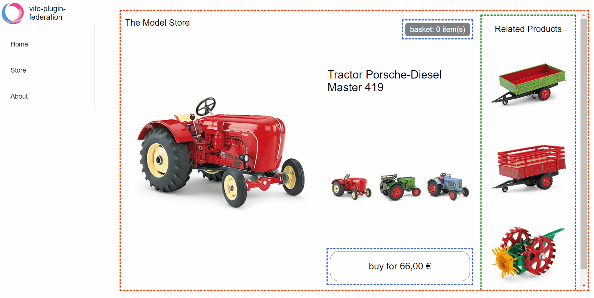

[English](./README.md) | 简体中文

# vite-plugin-federation

<p align="center">
  <a href="https://bestpractices.coreinfrastructure.org/projects/5752"></a>
  <a href="https://api.securityscorecards.dev/projects/github.com/originjs/vite-plugin-federation"></a>
  <a href="https://github.com/originjs/vite-plugin-federation/actions/workflows/ci.yml"></a>
  <a href="https://www.npmjs.com/package/@originjs/vite-plugin-federation"></a>
  <a href="https://nodejs.org/en/about/releases/"></a>
  <a href="https://www.npmjs.com/package/@originjs/vite-plugin-federation"></a>
 </p>

支持模块联邦Module Federation的 Vite/Rollup 插件，可以与 [Webpack Module Federation](https://webpack.js.org/concepts/module-federation/) 兼容。

## 运行效果



## 安装

```
npm install @originjs/vite-plugin-federation --save-dev
```

或者

```
yarn add @originjs/vite-plugin-federation --dev
```

## 使用

使用Module Federation通常需要2个以上的工程，一个作为Host端，一个作为Remote端。

#### 步骤一：Remote端配置暴露的模块

* 使用Vite构建的项目，修改`vite.config.js`
  
```js
// vite.config.js
import federation from "@originjs/vite-plugin-federation";
export default {
    plugins: [
        federation({
            name: 'remote-app',
            filename: 'remoteEntry.js',
            // 需要暴露的模块
            exposes: {
                './Button': './src/Button.vue',
            },
            shared: ['vue']
        })
    ]
}
```
*  使用Rollup构建的项目，修改`rollup.config.js`

```js
// rollup.config.js
import federation from '@originjs/vite-plugin-federation'
export default {
    input: 'src/index.js',
    plugins: [
        federation({
            name: 'remote-app',
            filename: 'remoteEntry.js',
            // 需要暴露的模块
            exposes: {
                './Button': './src/button'
            },
            shared: ['vue']
        })
    ]
}
```

#### 步骤二：Host端配置远程模块入口

* 使用Vite构建的项目，修改`vite.config.js`
```js
// vite.config.js
import federation from "@originjs/vite-plugin-federation";
export default {
    plugins: [
        federation({
            name: 'host-app',
            remotes: {
                remote_app: "http://localhost:5001/assets/remoteEntry.js",
            },
            shared: ['vue']
        })
    ]
}
```
*  使用Rollup构建的项目，修改`rollup.config.js`
```js
// rollup.config.js
import federation from '@originjs/vite-plugin-federation'
export default {
    input: 'src/index.js',
    plugins: [
        federation({
            name: 'host-app',
            remotes: {
                remote_app: "http://localhost:5001/remoteEntry.js",
            },
            shared: ['vue']
        })
    ]
}
```

#### 步骤三：Host端使用远程模块

以Vue项目为例

```js
import { createApp, defineAsyncComponent } from "vue";
const app = createApp(Layout);
...
const RemoteButton = defineAsyncComponent(() => import("remote_app/Button"));
app.component("RemoteButton", RemoteButton);
app.mount("#root");
```

在模板中使用远程组件

```vue
<template>
    <div>
        <RemoteButton />
    </div>
</template>
```

## 示例工程

| Examples                                                                                                                                | Host                                  | Remote                              |
| --------------------------------------------------------------------------------------------------------------------------------------- | ------------------------------------- | ----------------------------------- |
| [basic-host-remote](https://github.com/originjs/vite-plugin-federation/tree/main/packages/examples/basic-host-remote)                   | `rollup`+`esm`                        | `rollup`+`esm`                      |
| [react-in-vue](https://github.com/originjs/vite-plugin-federation/tree/main/packages/examples/react-in-vue)                             | `vite`+`esm`                          | `vite`+`esm`                        |
| [simple-react-esm](https://github.com/originjs/vite-plugin-federation/tree/main/packages/examples/simple-react-esm)                     | `rollup`+`esm`                        | `rollup`+`esm`                      |
| [simple-react-systemjs](https://github.com/originjs/vite-plugin-federation/tree/main/packages/examples/simple-react-systemjs)           | `rollup`+`systemjs`                   | `rollup`+`systemjs`                 |
| [simple-react-webpack](https://github.com/originjs/vite-plugin-federation/tree/main/packages/examples/simple-react-webpack)             | `rollup`+`systemjs`                   | `webpack`+`systemjs`                |
| [vue2-demo](https://github.com/originjs/vite-plugin-federation/tree/main/packages/examples/vue2-demo)                                   | `vite`+`esm`                          | `vite`+`esm`                        |
| [vue3-advanced-demo](https://github.com/originjs/vite-plugin-federation/tree/main/packages/examples/vue3-advanced-demo)                 | `vite`+`esm` <br/>`vue-router`/`pinia` | `vite`+`esm`<br/>`vue-router`/`pinia` |
| [vue3-demo-esm](https://github.com/originjs/vite-plugin-federation/tree/main/packages/examples/vue3-demo-esm)                           | `vite`+`esm`                          | `vite`+`esm`                        |
| [vue3-demo-systemjs](https://github.com/originjs/vite-plugin-federation/tree/main/packages/examples/vue3-demo-systemjs)                 | `vite`+`systemjs`                     | `vite`+`systemjs`                   |
| [vue3-demo-webpack-esm-esm](https://github.com/originjs/vite-plugin-federation/tree/main/packages/examples/vue3-demo-webpack-esm-esm)   | `vite/webpack`+`esm`                  | `vite/webpack`+`esm`                |
| [vue3-demo-webpack-esm-var](https://github.com/originjs/vite-plugin-federation/tree/main/packages/examples/vue3-demo-webpack-esm-var)   | `vite`+`esm`                          | `webpack`+`var`                     |
| [vue3-demo-webpack-systemjs](https://github.com/originjs/vite-plugin-federation/tree/main/packages/examples/vue3-demo-webpack-systemjs) | `vite`+`systemjs`                     | `webpack`+`systemjs`                |

## 特性

### 与 Webpack 集成

现在可以不受 `Vite` 和 `Webpack` 的限制而使用Module Federation了! 也就是说，你可以选择在 `Webpack` 中使用 `vite-plugin-federation` 暴露的组件，也可以选择在 `Vite` 中使用 `Webpack ModuleFederationPlugin` 暴露的组件。但需要注意对于不同的打包框架，你需要指定 `remotes.from` 和 `remotes.format`属性以便使它们更好地工作。具体可以参考如下几个示例工程：

* [vue3-demo-webpack-esm-esm](https://github.com/originjs/vite-plugin-federation/tree/main/packages/examples/vue3-demo-webpack-esm-esm)

* [vue3-demo-webpack-esm-var](https://github.com/originjs/vite-plugin-federation/tree/main/packages/examples/vue3-demo-webpack-esm-var)

* [vue3-demo-webpack-systemjs](https://github.com/originjs/vite-plugin-federation/tree/main/packages/examples/vue3-demo-webpack-systemjs)

⚠️**注意：**

1.  `Vite` 使用 `Webpack` 组件相对容易，但是 `Webpack` 使用 `vite-plugin-federation` 组件时最好使用 `esm` 格式，因为其他格式暂时缺少完整的测试用例。

2. `React` 项目中不建议 `Vite`和 `Webpack` 混合使用，因为现在无法保证 `Vite/Rollup` 和 `Webpack` 打包 `commonjs` 时生成一致的 `chunk`，这可能会导致使用`shared` 出现问题。

### Vite Dev开发模式支持

因为 Vite 在 dev开发模式下基于 esbuild构建，所以我们单独提供了对 dev 模式的支持，可以在远程模块部署的情况下，利用 Vite 的高性能开发服务器。

⚠️**注意：**

* 只有Host端支持dev模式，Remote端需要使用`vite build`生成RemoteEntry.js包。这是由于Vite Dev模式是**Bundleless**不打包的，您可以使用`vite build --watch`到达类似热更新的效果。

### 静态导入

支持组件的静态导入和动态导入，下面展示两种方式的区别，你可以在`examples`中的项目中看到动态导入和静态导入的例子，下面是一个简单的示例：

+ Vue

```javascript
// dynamic import
const myButton = defineAsyncComponent(() => import('remote/myButton'));
app.component('my-button' , myButton);
// or
export default {
  name: 'App',
  components: {
    myButton: () => import('remote/myButton'),
  }
}
```
```javascript
// static import
import myButton from 'remote/myButton';
app.component('my-button' , myButton);
// or
export default {
  name: 'App',
  components: {
    myButton: myButton
  }
}
```

+ React

```js
// dynamic import
const myButton = React.lazy(() => import('remote/myButton'))

// static import
import myButton from 'remote/myButton'
```
⚠️**注意：**

* 静态导入可能会依赖到浏览器`Top-level await`特性，因此需要将配置文件中的build.target设置为`next`或使用插件[`vite-plugin-top-level-await`](https://github.com/Menci/vite-plugin-top-level-await)。您可以在此查看Top-level await的[浏览器兼容性](https://developer.mozilla.org/en-US/docs/Web/JavaScript/Reference/Operators/await#browser_compatibility)

## 配置项说明

### `name：string`
* 作为远程模块的模块名称，必填。

### `filename：string`
* 作为远程模块的入口文件，非必填，默认为`remoteEntry.js`
### `exposes`

* 作为远程模块，对外暴露的组件列表，远程模块必填。
```js
exposes: {
    // '对外暴露的组件名称':'对外暴露的组件地址'
    './remote-simple-button': './src/components/Button.vue',
    './remote-simple-section': './src/components/Section.vue'
}
```

----
### `remotes`
作为本地模块，引用的远端模块入口文件

#### `external:string|Promise<string>`
* 远程模块地址，例如：https://localhost:5011/remoteEntry.js
* 你可以简单地进行如下配置

```js
remotes: {
    // '远端模块名称':'远端模块入口文件地址'
    'remote-simple': 'http://localhost:5011/remoteEntry.js',
}
```
* 或者做一个稍微复杂的配置，如果你需要使用其他字段的话

```javascript
remotes: {
    remote-simple: {
        external: 'http://localhost:5011/remoteEntry.js',
        format: 'var',
        from: 'webpack'
    }
}
```

#### `externalType:'url'|'promise'`

* `default:'url'`

* 设置`external`的类型
  如果你想使用动态的URL地址，你可以设置`external`为一个promise，但是请注意需要同时指定`externalType`为'promise'，确保promise部分的代码正确并且返回`string`，否则可能打包失败，这里提供一个简单是示例
```js
remotes: {
      home: {
          external: `Promise.resolve('your url')`,
          externalType: 'promise'
      },
},

// or from networke
remotes: {
    remote-simple: {
        external: `fetch('your url').then(response=>response.json()).then(data=>data.url)`,
        externalType: 'promise'
    }
}
```

#### `format` : `'esm'|'systemjs'|'var'`

* `default:'esm'`
* 指定远程组件的格式，当主机和远程端使用不同的打包格式时，这样做更有效，例如主机使用 `vite` + `esm`，远程使用 `webpack` + `var`，这时需要指定`type:'var'`

#### `from` : `'vite'|'webpack'`

* `default : 'vite'`
* 指定远程组件的来源，来源于 `vite-plugin-federation` 选择 `vite`，来源于 `webpack` 选择 `webpack`

----
### `shared`

本地模块和远程模块共享的依赖。本地模块需配置所有使用到的远端模块的依赖；远端模块需要配置对外提供的组件的依赖。

#### `import: boolean`

* `default: true`
* 默认为 `true` ，是否加入shared共享该模块，仅对 `remote` 端生效，`remote` 开启该配置后，会减少部分打包时间，因为不需要打包部分` shared`，但是一旦 `host` 端没有可用的 `shared` 模块，会直接报错，因为没有可用的回退模块

#### `shareScope: string`

* `default: 'default'`
* 默认为 `defualt`，共享域名称，保持 `remote` 和 `host` 端一致即可

#### `version: string`

* 仅对 `host` 端生效，提供的share模块的版本，默认为share包中的 `package.json` 文件的 `version` ，只有当以此法无法获取 `version` 时才需要手动配置

#### `requiredVersion: string`

* 仅对 `remote` 端生效，规定所使用的 `host shared` 所需要的版本，当 `host` 端的版本不符合 `requiredVersion` 要求时，会使用自己的 `shared` 模块，前提是自己没有配置 `import=false` ，默认不启用该功能

#### `packagePath: string`

* `supportMode: only serve`
* 允许自定义软件包通过packagePath共享（以前只限于node_modules下的软件包）。
比如你只能定义类似的共享

```js
shared :{
    packageName:{
        ...
    }
}
```
* packageName必须是node_modules下的一个包，如vue、react等，但你不能定义自己的包。
但是现在你可以通过指定包的路径来共享一个自定义的包，比如说

```js
shared: {
    packageName: {
        packagePath:'./src/a/index.js'
    }
}
```

#### `generate : boolean`
* `default: true`
* 是否生成shared chunk文件 ，如果你确定host端有一个可以使用的shared，那么你可以在remote端设置不生成共享文件，以减少remote端的块文件的大小，该配置只在remote有效，host端无论如何都会生成自己的shared。
```js
shared: {
  packageName: {
    generate: false
  }
}
``

## FAQ

### ERROR: `Top-level` await is not available in the configured target environment

这是因为依赖到了浏览器的`top-level-await`特性，当设置的浏览器环境不支持该特性时就会出现该报错，解决办法是将`build.target`设置为`esnext`，你可以在[这里查看](https://developer.mozilla.org/en-US/docs/Web/JavaScript/Reference/Operators/await)各个浏览器对该特性的支持情况。

`build.target`也可以设置为
```js
 build: {
    target: ["chrome89", "edge89", "firefox89", "safari15"]
 }
```

或者使用插件[`vite-plugin-top-level-await`](https://github.com/Menci/vite-plugin-top-level-await)来消除`top-level-await`，在[vue3-demo-esm](https://github.com/originjs/vite-plugin-federation/tree/main/packages/examples/vue3-demo-esm)中演示了这种用法

### 没有正常生成chunk？

请检查是否使用`vite`的`dev`模式启动了项目，当前仅有完全纯净的host端才可以使用`dev`模式，`remote`端必须使用`build`模式才能使插件生效。

### React 使用federation的一些问题

建议查看这个[Issue](https://github.com/originjs/vite-plugin-federation/issues/173)，这里包含了大多数`React`相关的问题

#### 远程模块加载本地模块的共享依赖失败，例如`localhost/:1 Uncaught (in promise) TypeError: Failed to fetch dynamically imported module: http:your url`

原因：Vite 在启动服务时对于 IP、Port 有自动获取逻辑，在 Plugin 中还没有找到完全对应的获取逻辑，在部分情况下可能会出现获取失败。

解决：

在本地模块显式到声明 IP、Port、cacheDir，保证我们的 Plugin 可以正确的获取和传递依赖的地址。

本地模块的 vite.config.ts

```ts
export default defineConfig({
  server:{
    https: "http",
    host: "192.168.56.1",
    port: 5100,
  },
  cacheDir: "node_modules/.cacheDir",
}
```
## Star History

[](https://star-history.com/#originjs/vite-plugin-federation&Date)

## Wiki

[详细设计说明](https://github.com/originjs/vite-plugin-federation/wiki)
