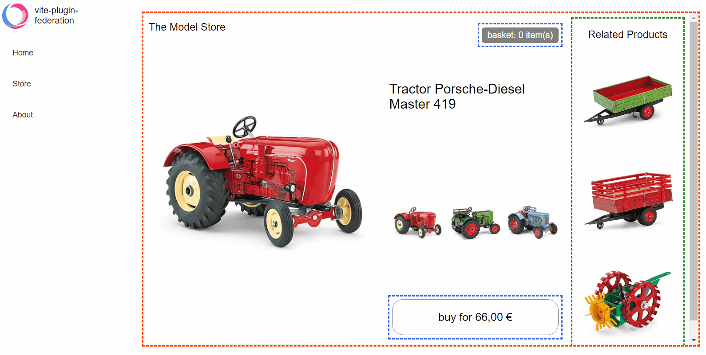

English | [简体中文](./README-zh.md)
# vite-plugin-federation

<p align="center">
  <a href="https://bestpractices.coreinfrastructure.org/projects/5752"></a>
  <a href="https://api.securityscorecards.dev/projects/github.com/originjs/vite-plugin-federation"></a>
  <a href="https://github.com/originjs/vite-plugin-federation/actions/workflows/ci.yml"></a>
  <a href="https://www.npmjs.com/package/@originjs/vite-plugin-federation"></a>
  <a href="https://nodejs.org/en/about/releases/"></a>
  <a href="https://www.npmjs.com/package/@originjs/vite-plugin-federation"></a>
 </p>

A Vite/Rollup plugin which support Module Federation.
Inspired by Webpack and compatible with [Webpack Module Federation](https://webpack.js.org/concepts/module-federation/).

## Running results



## Install

```
npm install @originjs/vite-plugin-federation --save-dev
```

or

```
yarn add @originjs/vite-plugin-federation --dev
```

## Usage
Using the `Module Federation` usually requires more than 2 projects, one as the `host side` and one as the `remote side`.
#### Step 1: Configure the remote side.
- for a vite project, modify `vite.config.js`:

```js
// vite.config.js
import federation from "@originjs/vite-plugin-federation";
export default {
    plugins: [
        federation({
            name: 'remote-app',
            filename: 'remoteEntry.js',
            // Modules to expose
            exposes: {
                './Button': './src/Button.vue',
            },
            shared: ['vue']
        })
    ]
}
```

- for a rollup project, modify `rollup.config.js`:

```js
// rollup.config.js
import federation from '@originjs/vite-plugin-federation'
export default {
    input: 'src/index.js',
    plugins: [
        federation({
            name: 'remote-app',
            filename: 'remoteEntry.js',
            // Modules to expose
            exposes: {
                './Button': './src/button'.
            },
            shared: ['vue']
        })
    ]
}
```

#### Step 2: Configure the host side

- for a vite project, modify `vite.config.js`:

```js
// vite.config.js
import federation from "@originjs/vite-plugin-federation";
export default {
    plugins: [
        federation({
            name: 'host-app',
            remotes: {
                remote_app: "http://localhost:5001/assets/remoteEntry.js",
            },
            shared: ['vue']
        })
    ]
}
```

- for a rollup project, modify `rollup.config.js`:

```js
// rollup.config.js
import federation from '@originjs/vite-plugin-federation'
export default {
    input: 'src/index.js',
    plugins: [
        federation({
            name: 'host-app',
            remotes: {
                remote_app: "http://localhost:5001/remoteEntry.js",
            },
            shared: ['vue']
        })
    ]
}
```

#### Step 3: Using remote modules on the host side

Using a Vue project as an example

```js
import { createApp, defineAsyncComponent } from "vue";
const app = createApp(Layout);
...
const RemoteButton = defineAsyncComponent(() => import("remote_app/Button"));
app.component("RemoteButton", RemoteButton);
app.mount("#root");
```
Using remote components in templates

```vue
<template>
    <div>
        <RemoteButton />
    </div>
</template>
```

## Example projects

| Examples                                                                                                                                | Host                                  | Remote                              |
| --------------------------------------------------------------------------------------------------------------------------------------- | ------------------------------------- | ----------------------------------- |
| [basic-host-remote](https://github.com/originjs/vite-plugin-federation/tree/main/packages/examples/basic-host-remote)                   | `rollup`+`esm`                        | `rollup`+`esm`                      |
| [react-in-vue](https://github.com/originjs/vite-plugin-federation/tree/main/packages/examples/react-in-vue)                             | `vite`+`esm`                          | `vite`+`esm`                        |
| [simple-react-esm](https://github.com/originjs/vite-plugin-federation/tree/main/packages/examples/simple-react-esm)                     | `rollup`+`esm`                        | `rollup`+`esm`                      |
| [simple-react-systemjs](https://github.com/originjs/vite-plugin-federation/tree/main/packages/examples/simple-react-systemjs)           | `rollup`+`systemjs`                   | `rollup`+`systemjs`                 |
| [simple-react-webpack](https://github.com/originjs/vite-plugin-federation/tree/main/packages/examples/simple-react-webpack)             | `rollup`+`systemjs`                   | `webpack`+`systemjs`                |
| [vue2-demo](https://github.com/originjs/vite-plugin-federation/tree/main/packages/examples/vue2-demo)                                   | `vite`+`esm`                          | `vite`+`esm`                        |
| [vue3-advanced-demo](https://github.com/originjs/vite-plugin-federation/tree/main/packages/examples/vue3-advanced-demo)                 | `vite`+`esm` <br/>`vue-router`/`pinia` | `vite`+`esm`<br/>`vue-router`/`pinia` |
| [vue3-demo-esm](https://github.com/originjs/vite-plugin-federation/tree/main/packages/examples/vue3-demo-esm)                           | `vite`+`esm`                          | `vite`+`esm`                        |
| [vue3-demo-systemjs](https://github.com/originjs/vite-plugin-federation/tree/main/packages/examples/vue3-demo-systemjs)                 | `vite`+`systemjs`                     | `vite`+`systemjs`                   |
| [vue3-demo-webpack-esm-esm](https://github.com/originjs/vite-plugin-federation/tree/main/packages/examples/vue3-demo-webpack-esm-esm)   | `vite/webpack`+`esm`                  | `vite/webpack`+`esm`                |
| [vue3-demo-webpack-esm-var](https://github.com/originjs/vite-plugin-federation/tree/main/packages/examples/vue3-demo-webpack-esm-var)   | `vite`+`esm`                          | `webpack`+`var`                     |
| [vue3-demo-webpack-systemjs](https://github.com/originjs/vite-plugin-federation/tree/main/packages/examples/vue3-demo-webpack-systemjs) | `vite`+`systemjs`                     | `webpack`+`systemjs`                |

## Features
### Integration with Webpack
It is now possible to use Module Federation without the restrictions of `Vite` and `Webpack`! That is, you can choose to use the components exposed by `vite-plugin-federation` in `Webpack` or the components exposed by `Webpack ModuleFederationPlugin` in `Vite`. But you need to pay attention to the configuration in `remotes`, for different frameworks you need to specify `remotes.from` and `remotes.format` to make them work better. A couple of example projects can be found here.

* [vue3-demo-webpack-esm-esm](https://github.com/originjs/vite-plugin-federation/tree/main/packages/examples/vue3-demo-webpack-esm-esm)

* [vue3-demo-webpack-esm-var](https://github.com/originjs/vite-plugin-federation/tree/main/packages/examples/vue3-demo-webpack-esm-var)

* [vue3-demo-webpack-systemjs](https://github.com/originjs/vite-plugin-federation/tree/main/packages/examples/vue3-demo-webpack-systemjs)

⚠️ **Note:**
1. `Vite` is relatively easy to use with the `Webpack` component, but `Webpack` is best used with the `vite-plugin-federation` component using the `esm` format, as the other formats lack complete test cases for now.

2. It is not recommended to mix `Vite` and `Webpack` in `React` projects, as there is no guarantee that `Vite/Rollup` and `Webpack` will generate the same `chunk` when packaging `commonjs`, which may cause problems with `shared`.

### Vite Dev mode

As Vite is built on esbuild in dev development mode, we provide separate support for dev mode to take advantage of Vite's high performance development server in the case of remote module deployment.

⚠️ **Note:**

* Only the Host side supports dev mode, the Remote side requires the RemoteEntry.js package to be generated using `vite build`. This is because Vite Dev mode is **Bundleless** and you can use `vite build --watch` to achieve a hot update effect.

### Static import

Static import and dynamic import of components are supported, the following shows the difference between the two methods, you can see examples of dynamic import and static import in the project in `examples`, here is a simple example.

+ Vue

```javascript
// dynamic import
const myButton = defineAsyncComponent(() => import('remote/myButton'));
app.component('my-button' , myButton);
// or
export default {
  name: 'App',
  components: {
    myButton: () => import('remote/myButton'),
  }
}
```
```javascript
// static import
import myButton from 'remote/myButton';
app.component('my-button' , myButton);
// or
export default {
  name: 'App',
  components: {
    myButton: myButton
  }
}
```

+ React

```js
// dynamic import
const myButton = React.lazy(() => import('remote/myButton'))

// static import
import myButton from 'remote/myButton'
```

⚠️ **Note:**
* Static imports may rely on the browser `Top-level await` feature, so you will need to set build.target in the configuration file to `next` or use the plugin [`vite-plugin-top-level-await`](https://github.com/Menci/vite-plugin-top-level-await). You can see the [browser compatibility](https://developer.mozilla.org/en-US/docs/Web/JavaScript/Reference/Operators/await#browser_) of top-level await here compatibility)
* 
## Configuration

### `name: string`
Required as the module name of the remote module.

### `filename:string`
As the entry file of the remote module, not required, default is `remoteEntry.js`
### `exposes`
* As the remote module, the list of components exposed to the public, required for the remote module.
```js
exposes: {
// 'externally exposed component name': 'externally exposed component address'
    './remote-simple-button': './src/components/Button.vue',
        './remote-simple-section': './src/components/Section.vue'
},
```

----
### `remotes`

The remote module entry file referenced as a local module

#### `external:string|Promise<string>`
* remote module address, e.g. https://localhost:5011/remoteEntry.js
* You can simply configure it as follows

```js
  remotes: {
    // 'remote module name': 'remote module entry file address'
    'remote-simple': 'http://localhost:5011/remoteEntry.js',
}
```
* Or do a slightly more complex configuration, if you need to use other fields
``` javascript
remotes: {
    remote-simple: {
        external: 'http://localhost:5011/remoteEntry.js',
        format: 'var',
    }
}
```
#### `externalType: 'url'|'promise'`
* `default: 'url'`
* Set the type of external. If you want to use a dynamic url address, you can set the `external` as `promise`, but please note that you need to set the `externalType` as 'promise' at the same time, and please ensure that the code of the `promise` part is correct, otherwise the package may fail,here is a simple example.

``` js
remotes: {
      home: {
          external: `Promise.resolve('your url')`,
          externalType: 'promise'
      },
},
    
// or from networke
remotes: {
    remote-simple: {
        external: `fetch('your url').then(response=>response.json()).then(data=>data.url)`,
        externalType: 'promise'
    }
}
```

#### `format:'esm'|'systemjs'|'var'`

* `default:'esm'`
* Specify the format of the remote component, this is more effective when the host and the remote use different packaging formats, for example the host uses vite + esm and the remote uses webpack + var, in which case you need to specify `type` : `'var'`

#### `from` : `'vite'|'webpack'`

* `default : 'vite'`
* Specify the source of the remote component, from `vite-plugin-federation` select `vite`, from `webpack` select `webpack`

----
### `shared`

Dependencies shared by local and remote modules. Local modules need to configure the dependencies of all used remote modules; remote modules need to configure the dependencies of externally provided components.

#### `import: boolean`

* `default: true`
* The default is `true`, whether to add shared to the module, only for the `remote` side, `remote` will reduce some of the packaging time when this configuration is turned on, because there is no need to package some of the `shared`, but once there is no `shared` module available on the `host` side, it will report an error directly, because there is no fallback module available

#### `shareScope: string`

* `default: 'default'`
* Default is `defualt`, the shared domain name, just keep the `remote` and `host` sides the same

#### `version: string`
Only works on `host` side, the version of the shared module provided is `version` of the `package.json` file in the shared package by default, you need to configure it manually only if you can't get `version` by this method

#### `requiredVersion: string`
Only for the `remote` side, it specifies the required version of the `host shared` used, when the version of the `host` side does not meet the `requiredVersion` requirement, it will use its own `shared` module, provided that it is not configured with `import=false`, which is not enabled by default

#### `packagePath: string`
* `supportMode: only serve`
* Allow custom packages to be shared via packagePath (previously limited to those under node_modules),
For Example
You can only define similar shared
```js
shared :{
    packageName:{
        ...
    }
}
```
* packageName must be a package under node_modules, such as vue, react, etc., but you cannot define your own package.
But now you can share a custom package by specifying the package path, for example
```js
shared: {
    packageName: {
        packagePath: './src/a/index.js'
    }
}
```

#### `generate : boolean`
* `default: true` 
* generate a shared chunk file or not , if you make sure that the host side has a share that can be used, then you can set not to generate a shared file on the remote side to reduce the size of the remote's chunk file, which is only effective on the remote side, the host side will generate a shared chunk no matter what.
```js
shared: {
    packageName: {
        generate: false
    }
}
```

## FAQ

### ERROR: `Top-level` await is not available in the configured target environment

The solution is to set `build.target` to `esnext`, which you can find at https://developer.mozilla.org/en-US/docs/Web/JavaScript/Reference/Operators/await to see the support for this feature in each browser.

```ts
build: {
    target: "esnext"
  }
```
or
```js
 build: {
    target: ["chrome89", "edge89", "firefox89", "safari15"]
 }
```

Or you can try using the plugin [`vite-plugin-top-level-await`](https://github.com/Menci/vite-plugin-top-level-await) to eliminate `top-level-await`, as demonstrated in [vue3-demo- esm](https://github.com/originjs/vite-plugin-federation/tree/main/packages/examples/vue3-demo-esm) demonstrates this usage

### Is not generating chunk properly?

Please check if you have started the project in `dev` mode with `vite`, currently only the fully pure host side can use `dev` mode, the `remote` side must use `build` mode to make the plugin take effect.


### React uses federation for some questions

It is recommended to check this [Issue](https://github.com/originjs/vite-plugin-federation/issues/173), which contains most of the `React` related issues


### The remote module failed to load the share of the local module, for example`localhost/:1 Uncaught (in promise) TypeError: Failed to fetch dynamically imported module: http://your url`

Reason: Vite has auto fetch logic for `IP` and Port when starting the service, no full fetch logic has been found in the `Plugin`, and in some cases a fetch failure may occur.

Solutions：

Explicitly declaring IP, Port, `cacheDir` in the local module ensures that our `Plugin` can correctly fetch and pass the dependent addresses.

Local module's `vite.config.ts`

```ts
export default defineConfig({
  server:{
    https: "http",
    host: "192.168.56.1",
    port: 5100,
  },
  cacheDir: "node_modules/.cacheDir",
}
```

## Star History

[](https://star-history.com/#originjs/vite-plugin-federation&Date)

## Wiki

[Detailed design](https://github.com/originjs/vite-plugin-federation/wiki)
